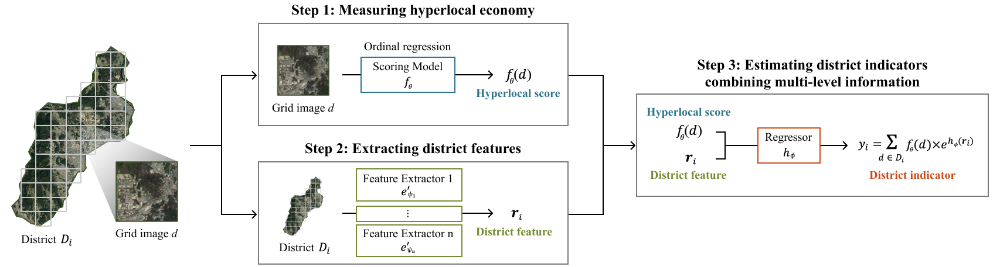
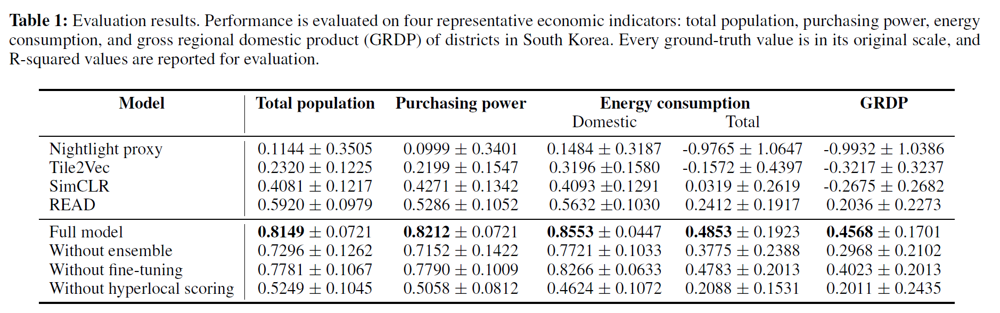

# Learning Economic Indicators by Aggregating Multi-Level Geospatial Information (AAAI 2022)

Pytorch Implementation of Learning Economic Indicators by Aggregating Multi-Level Geospatial Information
* Our model is a novel learning model that utilizes multiple levels of geographic information to predict economic indicators.
* Step 1. our model measures the hyperlocal economy by inferring the relative degree of individual grid image’s economic development via ordinal regression.
* Step 2. the interconnected relationship among small grid areas within the same district is summarized as district features.
* Step 3. our model finally estimates economic indicators of districts by jointly utilizing the hyperlocal predictions and district features.

## Model architecture ##
<center> </center>

### Step 1-A. Proxy Pretrain
* * *
##### 1-proxy_pretrain.py
Training model with softlabel proxy (Ordinal Regression) or nightlight proxy (Pearson Maximization).

```
usage: 1-proxy_pretrain.py [-h] [--mode MODE] [--root-dir ROOT_DIR]
                           [--train-meta TRAIN_META] [--test-meta TEST_META]
                           [--thr1 THR1] [--thr2 THR2] [--lr LR]
                           [--batch-size BATCH_SIZE] [--epochs EPOCHS]
                           [--workers WORKERS]
```

##### Softlabel Proxy (Ordinal Regression) Example
```
python3 1-proxy_pretrain.py --mode ordinal --root-dir ./data/proxy/ 
                            --train-meta ./metadata/proxy_metadata_train.csv
                            --test-meta ./metadata/proxy_metadata_test.csv
                            --batch-size 50 --epochs 100 
```
##### Nightlight Proxy (Pearson Maximization) Example
```
python3 1-proxy_pretrain.py --mode nightlight --root-dir ./data/unified/ 
                            --train-meta ./metadata/korea_nightlight_proxy.csv
                            --batch-size 256 --epochs 20 
```
### Step 1-B. Data Pruning
* * *
##### 2-data_pruning.py
Pruning uninhabited images using Step 1 ordinal regression model
```
usage: 2-data_pruning.py [-h] [--model MODEL] [--thr1 THR1] [--thr2 THR2]
                         [--path PATH]
```
##### Data Pruning Example
```
python3 2-data_pruning.py --model ./model/proxy_ordinal.ckpt --path ./data/pruned
```

### Step 2-A. Fine-Tuning
* * *
##### 3-fine_tuing.py
Fine-tuning Step 1 models using deepcluster algorithm
```
usage: 3-fine_tuing.py [-h] [--mode MODE] [--m-path M_PATH]
                       [--proxy-meta PROXY_META] [--cluster-meta CLUSTER_META]
                       [--proxy-root PROXY_ROOT] [--cluster-root CLUSTER_ROOT]
                       [--proxy-batch PROXY_BATCH]
                       [--cluster-batch CLUSTER_BATCH] [--thr1 THR1]
                       [--thr2 THR2] [--lr LR] [--epochs EPOCHS]
                       [--c-num C_NUM]
```
##### Softlabel Proxy (Ordinal Regression) Fine-Tuning Example
```
python3 3-fine_tuing.py --mode ordinal --m-path ./model/proxy_ordinal.ckpt 
                        --proxy-meta ./metadata/proxy_metadata_train.csv
                        --cluster-meta ./metadata/total_metadata.csv
                        --proxy-root ./data/proxy/ --cluster-root ./data/pruned/
                        --proxy-batch 40 --cluster-batch 256 --c-num 30
```

##### Nightlight Proxy (Pearson Maximization) Fine-Tuning Example
```
python3 3-fine_tuing.py --mode nightlight --m-path ./model/proxy_nl.ckpt 
                        --proxy-meta ./metadata/korea_nightlight_proxy.csv
                        --cluster-meta ./metadata/total_metadata.csv
                        --proxy-root ./data/unified/ --cluster-root ./data/pruned/
                        --proxy-batch 256 --cluster-batch 256 --c-num 30
```
### Step 2-B. Feature Extraction
* * *
##### 4-extract_feature.py
Extractiong local level score or district embedding feature
```
usage: 4-extract_feature.py [-h] [--mode MODE] [--m-path M_PATH]
                            [--metadata METADATA] [--root ROOT] [--thr1 THR1]
                            [--thr2 THR2]
```

##### Score Feature Extraction Example
```
python3 4-extract_feature.py --mode score -m-path ./model/proxy_ordinal.ckpt
                             --metadata ./metadata/kr_entire_demographics.csv
                             --root ./data/pruned/
```                             
##### District Embedding Feature Extraction Example
```
python3 4-extract_feature.py --mode embedding -m-path ./model/FEATURE_EXTRACTION_MODEL.ckpt
                             --metadata ./metadata/kr_entire_demographics.csv
                             --root ./data/pruned/
```                             
### Step 3. Economic Indicator Prediction
* * *
##### 4-extract_feature.py
Combining local-level score and district-level factor to predict economic indicator 
```
usage: 5-eval.py [-h] [--metadata METADATA] [--item ITEM]
                 [--ensemble-list ENSEMBLE_LIST] [--score-path SCORE_PATH]
                 [--train-ratio TRAIN_RATIO] [--train-count TRAIN_COUNT]
```
#####  Economic Indicator Prediction Example
```
python3 5-eval.py --metadata ./metadata/kr_entire_demographics.csv
                  --item ECON_ITEM (TOTPOP_CY, PP_CY, ...)
                  --ensemble-list ./district_summary/ensemble_list.txt
                  --score-path ./local_score/local_score.csv
                  --train-ratio 0.8 --train-count 100
```
## Result ##
<center> </center>


